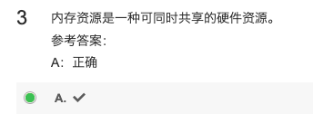
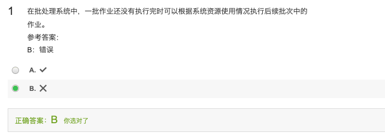
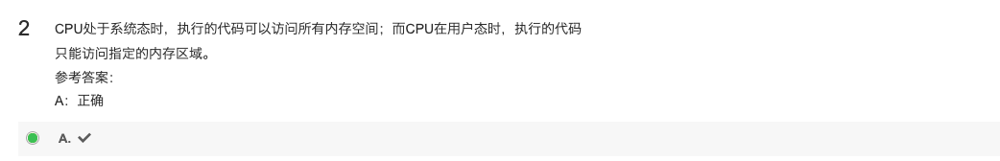
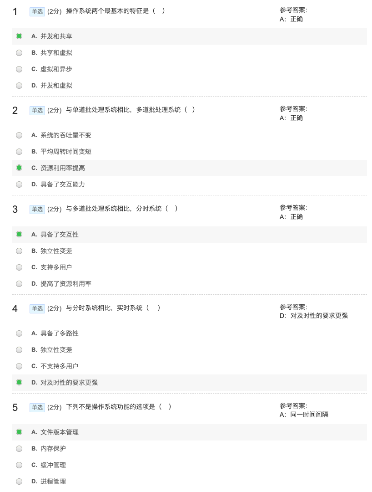
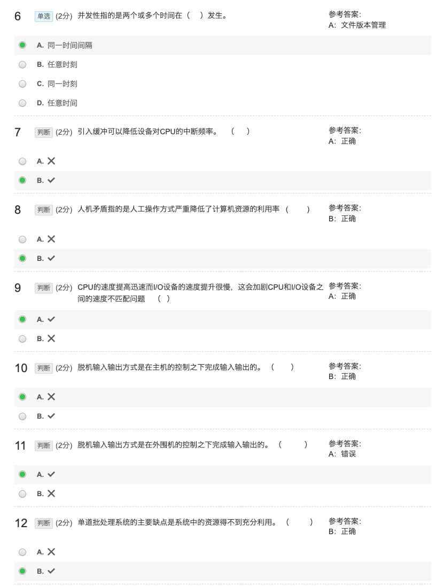
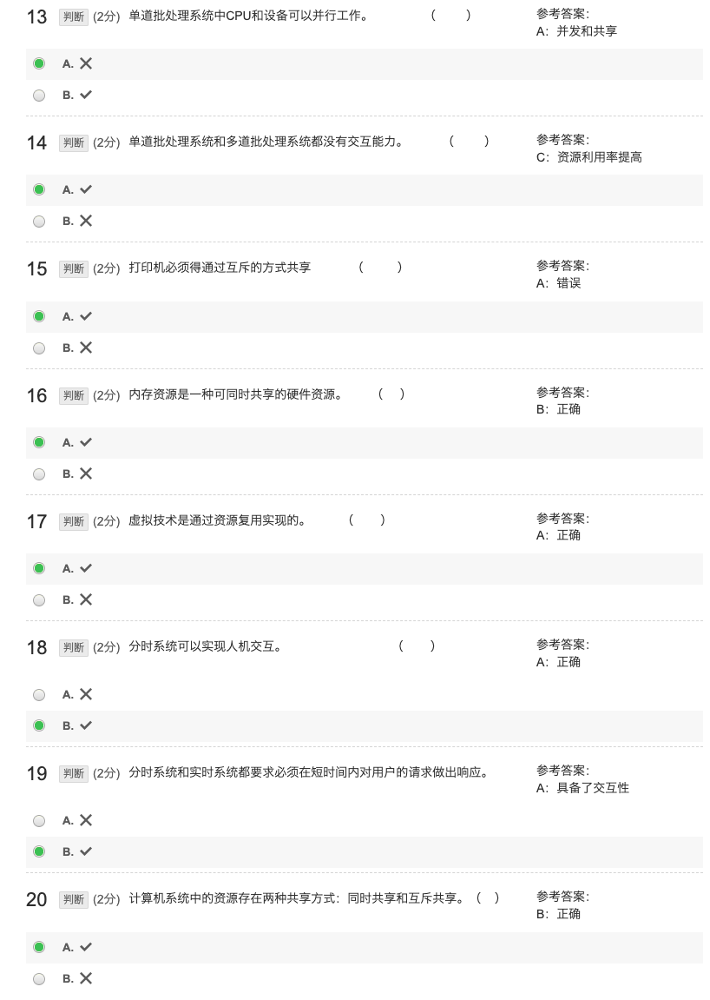

### OS MOOC习题

---

[TOC]

---

#### 1 操作系统的基础知识

##### 1.1 操作系统的概念

---

##### 1.2 批处理系统

错因：多道可以，单道不行

错因：多道可以，单道不行

---

##### 1.3 分时系统

错因：批处理不行

---

##### 1.4 CPU运行模式

---

##### 第一单元测试

#### 2 进程管理

##### 2.1 进程的概念