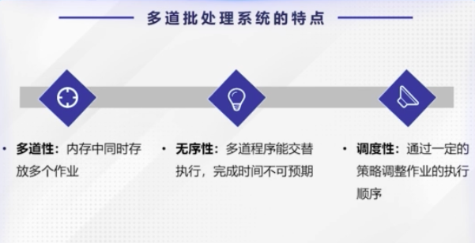
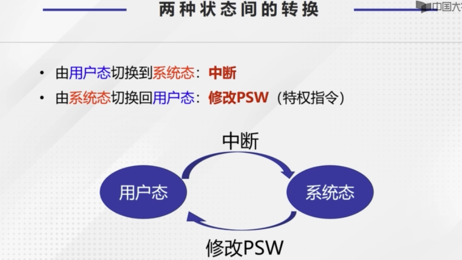

## 操作系统复习

---

[TOC]

---

### 1.操作系统的基础知识

#### 1.1 操作系统的基本概念

##### **1.1.1 操作系统的定义**

##### **1.1.2 操作系统的作用**

最重要的作用，管理计算机系统资源，包括硬件和软件。

**作用** : 

1. 资源管理者
2. 用户接口

##### **1.1.3 操作系统的特征**

**特征：**

1. 并发性：两个或多个时间在同一时间间隔内发生。
2. 共享性：系统中的资源可供内存中多个兵法进程共同使用。
3. 虚拟性：操作系统中所谓“虚拟”，是指通过某种技术把一个物理实体，变为若干个逻辑上的对应物。
4. 异步：进程是以人们不可预知的速度向前推进的。导致的原因：竞争资源。

##### **1.1.4 操作系统的地位**

位于硬件层之上，对计算机功能进行首次扩充，给其他软件起支撑作用。

---

#### 1.2 批处理系统

**1.2.1 批处理系统的工作原理**

是指用户将一批作业提交给操作系统后就不再干预具体执行过程，有操作系统控制它们的自动运行的工作机制。

**单道批处理系统**

单道批处理系统中，内存之运行存放一个作业，当前正在运行的作业驻留内存，执行的顺序是先进先出。

**特征：**

1.自动性：作业自动运行，无需干预。

2.顺序性：磁带上的各个作业按顺序地进入内存，先调入先完成。

3.单道性：内存中仅有一道程序运行，可以看成是串行的。

**多道批处理**

多道批处理系统，即在内存中可同时存在若干道作业，使之同时处于运行状态，这些作业共享CPU和外部设备等资源。

**特征：**

1. 多道性：内存中同时存放多个作业
2. 无序性：多道程序能交替运行，完成时间不可预期
3. 调度性：通过一定的策略调整作业的执行顺序

**优缺点**

---

#### 1.3 分时系统

**分时系统的概念：**分时系统是在一台主机上连接了多个带有显示器的键盘和终端，同时允许多个用户通过自己的低端，以交互方式使用计算机，共享主机中的资源。

**关键问题：**

**分时系统的主要特征：**

1. 多路性：系统允许将多台终端同时连接到一台主机上，并按分时原则为每个终端用户服务，提高了资源利用率，降低了使用费用。

2. 及时性：用户的请求能在很短的时间内就能得到响应。

3. 独立性：各个终端相互独立，互不干扰，每个用户都感觉像他一人独占主机一样。

4. 交互性：用户可以通过终端与系统人机对话，可以请求系统提供多方面的服务。

   

---

#### 1.4 CPU运行模式

**特权指令和非特权指令**

**两种状态间的转换：**

 

---

### 2 进程管理

#### 2.1 进程的概念

**2.1.1 引入进程的原因**

